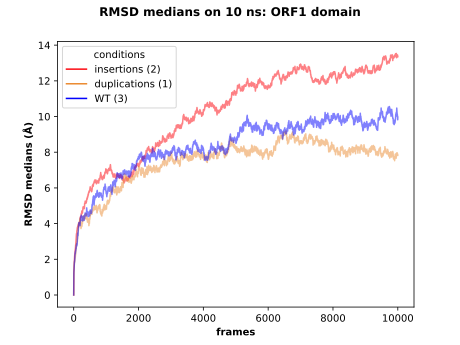
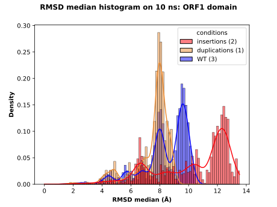

# RMS aggregation

Aggregate the RMS results in one plot selecting the samples by conditions.

The RMSD computation for each sample must have been performed with the `rms.py` script available in the 
[RMS repository](https://github.com/njeanne/rms). The CSV results files must be gathered in directories by conditions.

The input file is a CSV (comma separated without header) which columns described respectively the condition, the path 
to the directory for the condition and the color in hexadecimal format for the condition. The CSV test data 
(`tests/inputs/inputs_conditions.csv`) looks like:

|   |   |   |
|---|---|---|
| insertions  | tests/inputs/insertions  | #fc030b |
| duplications | tests/inputs/duplications | #eb8c34 |
| WT  | tests/inputs/WT | #0303fc |

For each condition of the CSV file, the script will search for RMSD CSV files and aggregate them, then compute the 
median for each frame of the different sample. Finally the script will produce a plot of the median RMSD at each frame.

## Conda environment

A [conda](https://docs.conda.io/projects/conda/en/latest/index.html) YAML environment file is provided: 
`conda_env/rms_env.yml`. The file contains all the dependencies to run the script.

The conda environment is created using the command:
```shell script
# create the environment
conda env create -f conda_env/rms_env.yml

# activate the environment
conda activate rms
```

The usage of the script after activating the conda environment can be displayed with:
```shell script
./rms_aggregate.py -h
```

## Usage

The script can be tested with the data in the `test` directory, choosing the median method to aggregate the data:
```shell script
conda activate rms

./rms_aggregate.py --out results --md-time 10 --aggregation median \
--domain "domain ORF1" --format svg tests/inputs/inputs_conditions.csv

conda deactivate
```

The outputs are:

- a line plot of the median RMSD by condition:



- a histogram of the median RMSD by condition:



The legend displays the conditions and the number of samples for each one.

- a CSV file of the data used to produce the plots:

|frames|conditions    |RMSD median          |
|------|--------------|---------------------|
|0     |insertions (2)|2.216720068438231e-06|
|1     |insertions (2)|0.8050448286771396   |
|2     |insertions (2)|1.0081313071062543   |
|3     |insertions (2)|1.110732131454152    |
|4     |insertions (2)|1.199277985750374    |
|...|...|...|
|9997|WT (3)        |9.819328079604023    |
|9998|WT (3)        |9.832846184222385    |
|9999|WT (3)        |9.913495964357445    |
|10000|WT (3)        |9.966963957259864    |

- a statistics test file:
```typescript
############################
#                          #
#     data description     #
#                          #
############################

Description of the "insertions" distribution:
	observations:       10001
	minimum:            2.216720068438231e-06
	maximum:            13.533416242933168
	mean:               10.251366400252236
	variance:           6.532891758092699
	skewness:           -0.8554019307620713
	kurtosis:           -0.26643709270749794

Normality test (Shapiro) for the "insertions" distribution:
	p.value:            0.0
	statistic:          0.8857440948486328
	Interpretation:     "insertions" distribution do not follows a Normal law at α risk of 0.05 (p.value <= 0.05)

Description of the "duplications" distribution:
	observations:       10001
	minimum:            0.0
	maximum:            9.188761271029136
	mean:               7.4577601492203005
	variance:           1.7600289149729986
	skewness:           -1.7069073209684353
	kurtosis:           2.752278403094218

Normality test (Shapiro) for the "duplications" distribution:
	p.value:            0.0
	statistic:          0.8082096576690674
	Interpretation:     "duplications" distribution do not follows a Normal law at α risk of 0.05 (p.value <= 0.05)

Description of the "WT" distribution:
	observations:       10001
	minimum:            0.0
	maximum:            10.559005269588562
	mean:               8.354134646534321
	variance:           2.705853055738313
	skewness:           -1.3282034756539687
	kurtosis:           1.656416203015321

Normality test (Shapiro) for the "WT" distribution:
	p.value:            0.0
	statistic:          0.8720040321350098
	Interpretation:     "WT" distribution do not follows a Normal law at α risk of 0.05 (p.value <= 0.05)


Variance equality (Bartlett test) for the "insertions, duplications, WT" distributions:
	p.value:            0.0
	statistic:          4598.96906025276
	Interpretation:     For "insertions, duplications, WT" distributions the variance are  not equals at α risk of 0.05 (p.value <= 0.05)


############################
#                          #
#     statistical tests    #
#                          #
############################

****************** At least one distribution do not follows a normal law, Kruskall-Wallis and Mann-Whitney U tests will be applied. ******************

Kruskall Wallis test for the "insertions, duplications, WT" distributions:
	p.value:            0.0
	statistic:          7455.944854399725
	Interpretation:     at least one distribution has a mean distinct from the others at a α risk of 0.05 (p.value <= 0.05)


Mann Withney U test for the "insertions" and "duplications" distributions:
	p.value:            0.0
	statistic:          80251866.0
	Interpretation:     "insertions" and "duplications" have a different mean at a α risk of 0.05 (p.value <= 0.05)


Mann Withney U test for the "insertions" and "WT" distributions:
	p.value:            0.0
	statistic:          74402925.0
	Interpretation:     "insertions" and "WT" have a different mean at a α risk of 0.05 (p.value <= 0.05)


Mann Withney U test for the "duplications" and "WT" distributions:
	p.value:            0.0
	statistic:          29308400.5
	Interpretation:     "duplications" and "WT" have a different mean at a α risk of 0.05 (p.value <= 0.05)


```