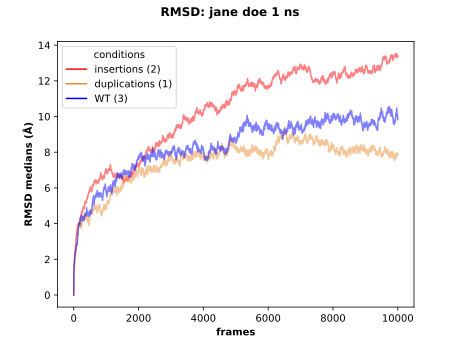

# rms_aggregate

Aggregate the RMS results in one plot selecting the samples by conditions.

The RMSD computation for each sample must have been performed with the `rms.py` script available in the 
[RMS repository](https://github.com/njeanne/rms). The CSV results files must be gathered in directories by conditions.

The input file is a CSV (comma separated without header) which columns described respectively the condition, the path 
to the directory for the condition and the color in hexadecimal format for the condition. The CSV test data 
(`tests/inputs/inputs_conditions.csv`) looks like:

|   |   |   |
|---|---|---|
| insertions  | tests/inputs/insertions  | #fc030b |
| duplications | tests/inputs/duplications | #eb8c34 |
| WT  | tests/inputs/WT | #0303fc |

For each condition of the CSV file, the script will search for RMSD CSV files and aggregate them, then compute the 
median for each frame of the different sample. Finally the script will produce a plot of the median RMSD at each frame.

The script can be tested with the data in the `test` directory:
```shell script
./rms_aggregate.py --out results --md-time 1 --domain "jane doe" --format svg tests/inputs/inputs_conditions.csv
```

The output is a plot of the median RMSD:



The legend displays the conditions and the number of samples for each.