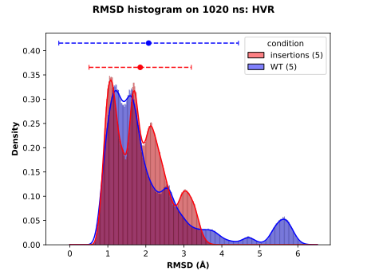

# RMS aggregation

Aggregate the RMS results in one plot selecting the samples by conditions.

The RMSD computation for each sample must have been performed with the `rms.py` script available in the 
[RMS repository](https://github.com/njeanne/rms). The CSV results files must be gathered in directories by conditions.

The input file is a CSV (comma separated without a header) which columns described respectively the condition, the path 
to the directory for the condition and the color in hexadecimal format for the condition. The CSV test data 
(`tests/inputs/inputs_conditions.csv`) looks like:

|   |   |   |
|---|---|---|
| insertions  | tests/inputs/insertions  | #fc030b |
| duplications | tests/inputs/duplications | #eb8c34 |
| WT  | tests/inputs/WT | #0303fc |

For each condition of the CSV file, the script will search for RMSD CSV files and aggregate them, then compute the 
median for each frame of the different sample. Finally the script will produce a plot of the median RMSD at each frame.

## Conda environment

A [conda](https://docs.conda.io/projects/conda/en/latest/index.html) YAML environment file is provided: 
`conda_env/rms_env.yml`. The file contains all the dependencies to run the script.

The conda environment is created using the command:
```shell script
# create the environment
conda env create -f conda_env/rms_env.yml

# activate the environment
conda activate rms
```

The usage of the script after activating the conda environment can be displayed with:
```shell script
./rms_aggregate.py -h
```

## Usage

The script can be tested with the data in the `test` directory, choosing the median method to aggregate the data:
```shell script
conda activate rms

./rms_aggregate.py --out results --md-time 1020 --aggregation median \
--domain "domain ORF1" --format svg tests/inputs/inputs_conditions.csv

conda deactivate
```

## Outputs

### All the samples by condition

- a CSV file of the data used to produce the histogram: `RMSD_data_HVR_1020-ns.csv`

|sample                   |condition     |RMSD              |
|-------------------------|--------------|------------------|
|HEPAC-100_GATM_ORF1_0_HVR|insertions (5)|0.9344221383474036|
|HEPAC-100_GATM_ORF1_0_HVR|insertions (5)|0.9641598765363264|
|HEPAC-100_GATM_ORF1_0_HVR|insertions (5)|0.9667631174199266|
|…                        |…             |…                 |
|JQ679014_WT_ORF1_0_HVR   |WT (5)        |0.8020449336479927|
|JQ679014_WT_ORF1_0_HVR   |WT (5)        |0.7815537791307146|
|JQ679014_WT_ORF1_0_HVR   |WT (5)        |0.8716277115849276|


- the RMSD boxplots for each sample: `RMSD_boxplots_by_sample_HVR_1020-ns.svg`


- a statistics file with the confidence interval values: `statistics_RMSD_HVR_1020-ns.csv`

|condition |mean              |minimum confidence interval|maximum confidence interval|observations|minimum               |maximum          |variance           |skewness           |kurtosis           |
|----------|------------------|---------------------------|---------------------------|------------|----------------------|-----------------|-------------------|-------------------|-------------------|
|insertions|1.8519868675457272|0.5057795591612184         |3.1981941759302357         |925000      |0.0                   |3.985055324238989|0.47176766977231716|0.46596832038581276|-0.6615830793576922|
|WT        |2.0741305977201216|-0.2899843829575661        |4.43824557839781           |925000      |1.7608379027271185e-07|6.513816433285587|1.4549279180002745 |1.714390862447855  |2.4421151733641215 |


- a histogram of the RMSD samples by condition: `RMSD_histogram_HVR_1020-ns.svg`



The dots represent the means and the dashed lines the confidence intervals.

### The median of the samples by condition

- a CSV file of the data used to produce the plots: `RMSD_aggregated_median_data_HVR_1020-ns.csv`

|frames|conditions    |RMSD median          |
|------|--------------|---------------------|
|0     |insertions (2)|2.216720068438231e-06|
|1     |insertions (2)|0.8050448286771396   |
|2     |insertions (2)|1.0081313071062543   |
|3     |insertions (2)|1.110732131454152    |
|4     |insertions (2)|1.199277985750374    |
|...|...|...|
|9997|WT (3)        |9.819328079604023    |
|9998|WT (3)        |9.832846184222385    |
|9999|WT (3)        |9.913495964357445    |
|10000|WT (3)        |9.966963957259864    |

- a line plot of the median RMSD by condition: `RMSD_aggregated_median_HVR_1020-ns.svg`


- a histogram of the median RMSD by condition: `RMSD_aggregated_median_histogram_HVR_1020-ns.svg`


The legend displays the conditions and the number of samples for each one.

- a statistics file: `statistics_median_aggregated_RMSD_HVR_1020-ns.txt`

*As there is a lot of data, the p-values can be significative just with a small variation. It is more careful to 
compare the results with the confidence intervals of the file `statistics_RMSD_HVR_1020-ns.csv`.*

```typescript
############################
#                          #
#     Data Description     #
#                          #
############################
Description of the aggregated "insertions" distribution:
	observations:                           185000
	minimum:                                0.805384633044616
	maximum:                                2.986440599571852
	mean:                                   1.7676900390303465
	variance:                               0.28088876722626804
	skewness:                               0.02858148370723702
	kurtosis:                               -1.3956280375383006

Normality test (Shapiro) for the "insertions" distribution:
	/!\ p-value may not be accurate as N > 5000	p.value:                                0.0
	statistic:                              0.926400899887085
	Interpretation:                         "insertions" distribution do not follows a Normal law at α risk of 0.05 (p.value <= 0.05)

Description of the aggregated "WT" distribution:
	observations:                           185000
	minimum:                                0.848172759060962
	maximum:                                3.4969821978001026
	mean:                                   1.6869947290107705
	variance:                               0.1783671027413453
	skewness:                               0.9495642636983049
	kurtosis:                               0.5550084080136299

Normality test (Shapiro) for the "WT" distribution:
	/!\ p-value may not be accurate as N > 5000	p.value:                                0.0
	statistic:                              0.935417890548706
	Interpretation:                         "WT" distribution do not follows a Normal law at α risk of 0.05 (p.value <= 0.05)


Variance equality (Bartlett test) for the "insertions, WT" distributions:
	p.value:                                0.0
	statistic:                              9456.772548284825
	Interpretation:                         For "insertions, WT" distributions the variance are  not equals at α risk of 0.05 (p.value <= 0.05)


#############################
#                           #
#     Statistical Tests     #
#                           #
#############################
****************** At least one distribution do not follows a normal law, Kruskall-Wallis and Mann-Whitney U tests will be applied. ******************

Kruskall Wallis test for the "insertions, WT" distributions:
	p.value:                                0.0
	statistic:                              1428.3116181811783
	Interpretation:                         at least one distribution has a mean distinct from the others at a α risk of 0.05 (p.value <= 0.05)


Mann Withney U test for the "insertions" and "WT" distributions:
	p.value:                                0.0
	statistic:                              18340205040.0
	Interpretation:                         "insertions" and "WT" have a different mean at a α risk of 0.05 (p.value <= 0.05)
```